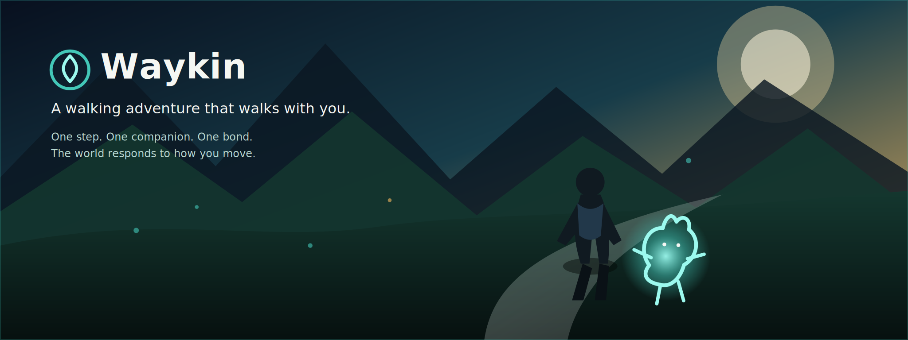

<p align="center">
  
</p>

<p align="center">
  <a href="docs/README.md"></a>
  <a href="ARCHITECTURE.md"></a>
  <a href="WAYKIN_SPEC.md"></a>
  <a href="#quick-start"></a>
  <a href="docs/canonical/CURRENT_CAPABILITY_MATRIX.md"></a>
</p>

<p align="center">
  <a href="docs/PHYSICAL_DEVICE_WALK_VALIDATION.md"></a>
  <a href="CONTRIBUTING.md"></a>
  <a href="AGENTS.md"></a>
  <a href="ROADMAP.md"></a>
  <a href="docs/governance/DOCUMENT_AUTHORITY.md"></a>
</p>

<p align="center">
  <a href="https://github.com/scrimshawlife-ctrl/Waykin/actions/workflows/validate.yml"></a>
  <a href="https://github.com/scrimshawlife-ctrl/Waykin/actions/workflows/waykin-ci.yml"></a>
  
  
  <a href="LICENSE"></a>
</p>

<p align="center">
  <strong>An audio-first adaptive walking experience.</strong><br>
  You move. Lira moves with you. The world responds. Bond grows.
</p>

> **Concept visual.** The hero communicates product direction and is not evidence of implemented application graphics or AR functionality. See [`docs/assets/BRAND_GUIDE.md`](docs/assets/BRAND_GUIDE.md).

---

## Why Waykin?

Waykin transforms an ordinary walk into a shared journey with a persistent digital companion. Rather than reducing movement to scores or competition, it focuses on **presence, relationship, discovery, tension, and memory**.

A walk produces semantic world state. That state generates bounded events. Events shape Lira, pursuit pressure, audio cues, session memories, and Bond—without requiring a backend or generative-AI runtime.

The launch product remains intentionally small enough for one developer to understand, test, and ship.

## Core Experience

| | Pillar | Current contract |
|---|---|---|
| 🚶 | **Real movement** | Walking is the launch activity and primary gameplay input. |
| ✨ | **Persistent companion** | Lira is the single companion and responds through a bounded behavior vocabulary. |
| 🌎 | **Adaptive world** | Seeded events emerge from movement, context, familiarity, energy, and pressure. |
| 🎧 | **Semantic audio** | Audio communicates presence, discovery, pressure, transition, and Bond. |
| 🏃 | **Bounded pursuit** | Tension exists without punishment, coercion, or an enemy-platform expansion. |
| ❤️ | **Bond** | One persistent progression measure represents the relationship with Lira. |

The binding product contract is [`WAYKIN_SPEC.md`](WAYKIN_SPEC.md). Future-state documents do not authorize implementation unless promoted through the repository’s governance process.

## Current Product Loop

```text
Home
  → Begin Walk (real) / Demo Walk
  → Active Session
  → Session Summary
  → Memory
```

Demo Mode runs the same deterministic loop without physical movement or location permission.

## Current MVP

| Capability | State | Evidence boundary |
|---|---|---|
| Walking session loop | ✅ Implemented | Package and native tests |
| Lira companion runtime | ✅ Implemented | Deterministic runtime tests |
| Bond progression | ✅ Implemented | Local persistence tests |
| Semantic audio cues | ✅ Implemented | Device playback still requires direct evidence |
| Deterministic Demo Mode | ✅ Implemented | Package-testable |
| Local session memories | ✅ Implemented | Concise, privacy-bounded facts |
| Real-walk Core Location wiring | 🟡 Validation | Outdoor behavior requires device receipts |
| AR presentation contracts | 🟡 In progress | AR device behavior remains evidence-gated |
| Multiplayer, marketplace, LiveOps | 🔒 Deferred | Outside current scope |
| Generalized AI Director | 🔒 Future reference | Not current implementation authority |

See the complete [`Current Capability Matrix`](docs/canonical/CURRENT_CAPABILITY_MATRIX.md).

## Quick Start

### Requirements

- macOS with a compatible Xcode installation
- Swift 6 toolchain
- [XcodeGen](https://github.com/yonaskolb/XcodeGen)
- An iOS Simulator for simulator validation

### Build and Validate

```bash
git clone https://github.com/scrimshawlife-ctrl/Waykin.git
cd Waykin

make build
make test
make validate
make validate-simulator
```

`make validate-simulator` targets `iPhone 17 Pro` by default. Override it with:

```bash
WAYKIN_SIMULATOR_NAME="iPhone 17 Pro" make validate-simulator
```

### Run the Deterministic Demo

```bash
make demo
```

## Runtime Architecture

<p align="center">
  
</p>

`WaykinCore` owns semantic gameplay truth. SwiftUI, MapKit, SwiftData, Core Location, AVFoundation, ARKit, and RealityKit remain adapters or presentation concerns.

The core knows semantic state and semantic audio cue kinds. It does not know UI layout, asset filenames, route-provider details, AR entities, or platform persistence implementation.

See [`ARCHITECTURE.md`](ARCHITECTURE.md) for ownership, dependency direction, AR boundaries, and deferred seams.

## Implemented Surface

- Deterministic walking-session state machine
- Real-sample movement integrity processing
- Seeded, weighted, cooldown-aware event generation
- Lira companion runtime
- Bounded pursuit state
- Seven semantic audio cue kinds
- App-target `AVAudioPlayer` adapter with safe-silence fallback
- SwiftData persistence for Bond and concise session memories
- Deterministic Demo Mode
- When-In-Use Core Location wiring for physical-device walks
- Privacy-filtered local field-test receipts
- Platform-neutral AR presentation contracts

Compatibility values for running, cycling, hiking, and climbing may remain in source models, but **walking is the only current product activity**.

## Scope Boundaries

Waykin does **not** currently include:

- Accounts, authentication, or backend infrastructure
- Multiplayer or social graphs
- Marketplace or creator systems
- Generative-AI runtime behavior
- Generalized narrative engines
- LiveOps, currencies, inventory, or skill trees
- Wearable dependence
- AR-glasses dependence
- Live weather integration

Future-state specifications are reference material until promoted through an accepted issue, architecture review, and—when necessary—an ADR. See [`DOCUMENT_AUTHORITY.md`](docs/governance/DOCUMENT_AUTHORITY.md) and [`SPEC_PROMOTION_PROCESS.md`](docs/governance/SPEC_PROMOTION_PROCESS.md).

## Safety and Privacy

- Waykin is not safety equipment.
- Location is requested only during an active real walk.
- Demo Mode requires no location permission.
- Pause and stop behavior remain available.
- Pursuit must never pressure a user to continue through distress or unsafe conditions.
- Memories are concise deterministic facts, not precise route archives.
- Field receipts exclude coordinates and personal memory text, retain at most 20 files, and never upload automatically.

## Validation Status

The following results were recorded on **July 16, 2026** and apply only to the tested repository state:

| Layer | Command or protocol | Recorded result |
|---|---|---|
| Swift package build | `make build` | PASS |
| Swift package tests | `make test` | PASS — 40 tests |
| Native app tests | Focused `xcodebuild test` | PASS — 58 tests |
| Canonical harness | `make validate` | PASS, including native app build |
| Simulator UI | `make validate-simulator` | PASS — 6 UI tests |
| Physical GPS walk | Manual protocol | `NOT_COMPUTABLE` in that receipt |
| Physical audio playback | Manual protocol | `NOT_COMPUTABLE` in that receipt |

Workflow badges report the current `main` branch state. Dated validation claims are historical evidence, not permanent guarantees. Do not claim GPS, device audio, battery, thermal, outdoor usability, interruption recovery, or AR behavior without direct device evidence.

## Roadmap

Waykin progresses by proving one bounded layer before promoting the next:

1. **Physical loop proof** — repeated outdoor movement and audio evidence.
2. **AR presentation** — app-target rendering without moving gameplay truth out of `WaykinCore`.
3. **Experience tuning** — sound design, event tuning, and refined Lira presentation.
4. **Future systems** — considered only through explicit promotion after MVP evidence gates.

See [`ROADMAP.md`](ROADMAP.md) for milestones, status labels, and promotion gates.

## Repository Guide

```text
Waykin/
├── App/                  iOS presentation and platform adapters
├── AppTests/             Native app tests
├── Sources/WaykinCore/   Platform-neutral semantic runtime
├── Tests/                Swift package tests
├── docs/                 Documentation, evidence, governance, and assets
├── scripts/              Canonical validation harnesses
├── WAYKIN_SPEC.md        Binding product contract
├── ARCHITECTURE.md       System ownership and dependency direction
├── AGENTS.md             Coding-agent operating contract
├── CONTRIBUTING.md       Human collaboration workflow
└── ROADMAP.md            Evidence-gated product progression
```

### Where to Start

1. Read [`WAYKIN_SPEC.md`](WAYKIN_SPEC.md).
2. Read [`ARCHITECTURE.md`](ARCHITECTURE.md).
3. Open the [`Documentation Portal`](docs/README.md).
4. Contributors read [`CONTRIBUTING.md`](CONTRIBUTING.md).
5. Coding agents also read [`AGENTS.md`](AGENTS.md).

## Contributor Flow

<p align="center">
  
</p>

Every pull request states its authority context, allowed and frozen systems, validation evidence, device-evidence status, risk, and rollback path.

## Documentation Portal

| Area | Start here |
|---|---|
| Product | [`WAYKIN_SPEC.md`](WAYKIN_SPEC.md) · [`SOLO_MVP_SCOPE.md`](docs/SOLO_MVP_SCOPE.md) · [`ROADMAP.md`](ROADMAP.md) |
| Engineering | [`ARCHITECTURE.md`](ARCHITECTURE.md) · [`CURRENT_CAPABILITY_MATRIX.md`](docs/canonical/CURRENT_CAPABILITY_MATRIX.md) |
| Validation | [`KNOWN_LIMITATIONS.md`](KNOWN_LIMITATIONS.md) · [`PHYSICAL_DEVICE_WALK_VALIDATION.md`](docs/PHYSICAL_DEVICE_WALK_VALIDATION.md) · [`FIELD_TEST_PROTOCOL.md`](docs/FIELD_TEST_PROTOCOL.md) |
| Collaboration | [`CONTRIBUTING.md`](CONTRIBUTING.md) · [`AGENTS.md`](AGENTS.md) |
| Governance | [`DOCUMENT_AUTHORITY.md`](docs/governance/DOCUMENT_AUTHORITY.md) · [`SPEC_PROMOTION_PROCESS.md`](docs/governance/SPEC_PROMOTION_PROCESS.md) · [`MASTER_PACK_INDEX.md`](docs/governance/MASTER_PACK_INDEX.md) |
| Visual identity | [`BRAND_GUIDE.md`](docs/assets/BRAND_GUIDE.md) |

Browse the complete [`Waykin Documentation Portal`](docs/README.md).

## Contributing

Waykin uses issue-scoped branches, small draft pull requests, explicit scope boundaries, and evidence-backed validation.

Start with [`CONTRIBUTING.md`](CONTRIBUTING.md). Coding agents must also read [`AGENTS.md`](AGENTS.md) before modifying the repository.

## License

Licensed under the [Apache License 2.0](LICENSE).