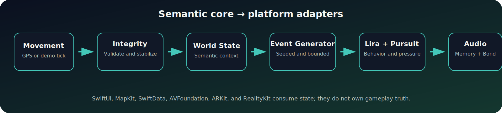
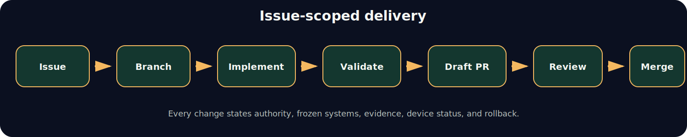

# Waykin Documentation Portal

Waykin documentation is organized by **authority**, **maturity**, and **evidence class**. Start with the binding product and architecture documents before consulting future-state material.

<p align="center">
  <a href="../WAYKIN_SPEC.md"></a>
  <a href="../ARCHITECTURE.md"></a>
  <a href="canonical/CURRENT_CAPABILITY_MATRIX.md"></a>
  <a href="../ROADMAP.md"></a>
</p>

## Start Here

| Order | Document | Authority | Purpose |
|---:|---|---|---|
| 1 | [`SOLO_MVP_SCOPE.md`](SOLO_MVP_SCOPE.md) | Binding | Solo-implementable launch boundary |
| 2 | [`../WAYKIN_SPEC.md`](../WAYKIN_SPEC.md) | Binding | Current product contract, MVP pillars, non-goals, and evidence rules |
| 3 | [`../README.md`](../README.md) | Binding summary | Public project overview and navigation |
| 4 | [`../ARCHITECTURE.md`](../ARCHITECTURE.md) | Binding | Runtime ownership, dependency direction, and deferred seams |
| 5 | [`../AGENTS.md`](../AGENTS.md) | Binding | Operating contract for coding agents and automation |
| 6 | [`../CONTRIBUTING.md`](../CONTRIBUTING.md) | Binding | Human collaboration and pull-request workflow |
| 7 | [`governance/DOCUMENT_AUTHORITY.md`](governance/DOCUMENT_AUTHORITY.md) | Binding | Precedence, maturity classes, and conflict resolution |

## Product

| Document | Purpose |
|---|---|
| [`../WAYKIN_SPEC.md`](../WAYKIN_SPEC.md) | Binding definition of the current walking experience |
| [`SOLO_MVP_SCOPE.md`](SOLO_MVP_SCOPE.md) | Constraints that keep Waykin implementable by one person |
| [`../ROADMAP.md`](../ROADMAP.md) | Evidence-gated progression from physical-loop proof to future systems |
| [`canonical/CURRENT_CAPABILITY_MATRIX.md`](canonical/CURRENT_CAPABILITY_MATRIX.md) | What is implemented, under validation, deferred, or future-only |
| [`../KNOWN_LIMITATIONS.md`](../KNOWN_LIMITATIONS.md) | Validated, partial, deferred, and `NOT_COMPUTABLE` gates |

## Engineering

| Document | Purpose |
|---|---|
| [`../ARCHITECTURE.md`](../ARCHITECTURE.md) | High-level engine boundaries and data flow |
| [`AUDIO_ASSET_CONTRACT.md`](AUDIO_ASSET_CONTRACT.md) | Semantic audio cue ownership and app-target asset mapping |
| [`../DEMO_SCRIPT.md`](../DEMO_SCRIPT.md) | Terminal demo and iOS simulator flows |
| [`assets/runtime-architecture.svg`](assets/runtime-architecture.svg) | Reusable runtime architecture diagram |

### Runtime Boundary

<p align="center">
  
</p>

`WaykinCore` owns semantic gameplay truth. Platform frameworks consume the state through adapters and presentation layers.

## Validation and Evidence

| Document | Purpose |
|---|---|
| [`PHYSICAL_DEVICE_WALK_VALIDATION.md`](PHYSICAL_DEVICE_WALK_VALIDATION.md) | Manual physical-iPhone walking protocol |
| [`FIELD_TEST_PROTOCOL.md`](FIELD_TEST_PROTOCOL.md) | Evidence gate, local receipts, subjective notes, and stop conditions |
| [`assets/screenshots/README.md`](assets/screenshots/README.md) | Distinction between real captures and concept visuals |
| [`../WAYKIN_MPOC_IMPLEMENTATION_RECEIPT.md`](../WAYKIN_MPOC_IMPLEMENTATION_RECEIPT.md) | Historical implementation snapshot |

### Evidence Language

- `OBSERVED` — directly verified from code, command output, simulator evidence, or physical evidence.
- `INFERRED` — derived from observed evidence and explicitly identified as inference.
- `NOT_COMPUTABLE` — required evidence is unavailable.
- `IMPLEMENTED_UNVERIFIED` — code exists but the required environment-specific evidence is incomplete.
- `DEFERRED` — intentionally outside the active milestone.

A green build does not validate GPS, device audio, battery, thermal behavior, outdoor usability, interruption recovery, or AR tracking. Those claims require their corresponding protocols.

## Legal

| Document | Purpose |
|---|---|
| [`legal/README.md`](legal/README.md) | Legal index (privacy, terms, safety, notices) |
| [`legal/PRIVACY.md`](legal/PRIVACY.md) | Privacy notice (draft for product review) |
| [`legal/TERMS.md`](legal/TERMS.md) | Terms of use (draft for product review) |
| [`legal/SAFETY.md`](legal/SAFETY.md) | Outdoor movement safety brief (in-app) |
| [`legal/NOTICES.md`](legal/NOTICES.md) | Apache 2.0 and third-party notices |
| [`../LICENSE`](../LICENSE) | Apache License 2.0 source license |

## Collaboration

| Document or template | Purpose |
|---|---|
| [`../CONTRIBUTING.md`](../CONTRIBUTING.md) | Branch, test, review, and merge workflow |
| [`../AGENTS.md`](../AGENTS.md) | Scope and evidence rules for coding agents |
| [`collaboration/REMOTE_COLLABORATOR_GUIDE.md`](collaboration/REMOTE_COLLABORATOR_GUIDE.md) | Remote setup, issue selection, agent use, validation, and handoff |
| [`collaboration/AGENT_TASK_PACKET_TEMPLATE.md`](collaboration/AGENT_TASK_PACKET_TEMPLATE.md) | Deterministic task packet for Fable, Claude Code, Codex, Hermes, or other agents |
| [`collaboration/ACTIVE_WORK.md`](collaboration/ACTIVE_WORK.md) | Human- and agent-readable ownership and dependency ledger |
| [`../.github/CODEOWNERS`](../.github/CODEOWNERS) | Default review ownership and protected authority surfaces |
| [`../.github/pull_request_template.md`](../.github/pull_request_template.md) | Required PR authority, evidence, risk, and dependency fields |
| [Feature issue form](../.github/ISSUE_TEMPLATE/feature.yml) | Defines outcome, authority, allowed systems, frozen systems, and tests |
| [Bug issue form](../.github/ISSUE_TEMPLATE/bug.yml) | Captures reproducible observed behavior and expected behavior |
| [Validation issue form](../.github/ISSUE_TEMPLATE/validation.yml) | Captures claim, environment, protocol, evidence artifact, and threshold |

<p align="center">
  
</p>

## Governance and Specification Promotion

| Document | Purpose |
|---|---|
| [`governance/DOCUMENT_AUTHORITY.md`](governance/DOCUMENT_AUTHORITY.md) | Canonical precedence and maturity classification |
| [`governance/MASTER_PACK_INDEX.md`](governance/MASTER_PACK_INDEX.md) | Classifies the master documentation pack without discarding future value |
| [`governance/SPEC_PROMOTION_PROCESS.md`](governance/SPEC_PROMOTION_PROCESS.md) | Promotes future concepts into current implementation authority |
| [`decisions/ADR-0001-document-authority-and-scope.md`](decisions/ADR-0001-document-authority-and-scope.md) | Establishes the repository’s authority model |

### Authority Principle

```text
Detailed future specification
        ≠
approved implementation scope
```

A future capability becomes actionable only through an accepted issue, explicit scope review, required canonical-document updates, and an ADR when architecture boundaries change.

## Visual Identity

| Document or asset | Classification | Purpose |
|---|---|---|
| [`assets/BRAND_GUIDE.md`](assets/BRAND_GUIDE.md) | Supporting | Palette, tone, accessibility, provenance, and usage rules |
| [`assets/waykin-hero.svg`](assets/waykin-hero.svg) | Concept visual | README hero and product-direction artwork |
| [`assets/runtime-architecture.svg`](assets/runtime-architecture.svg) | Engineering diagram | Semantic runtime and adapter boundary |
| [`assets/contributor-flow.svg`](assets/contributor-flow.svg) | Engineering diagram | Issue-scoped collaboration workflow |

Visuals clarify direction and architecture. They are not proof of implemented application graphics or device behavior.

## Maintenance Rules

1. Run `make validate` before changing package, test, or native-build claims.
2. Run `make validate-simulator` before changing simulator-visible claims.
3. Require direct physical evidence before changing GPS, device audio, battery, thermal, outdoor usability, or AR claims.
4. Attach dated validation claims to the tested commit, environment, and command or protocol.
5. Do not promote future-state or master-pack material by implication.
6. Keep diagrams aligned with `ARCHITECTURE.md` and the current capability matrix.
7. Label concept visuals and engineering diagrams explicitly.
8. Update this portal whenever a canonical document or major evidence protocol is added, moved, or retired.
9. Keep `collaboration/ACTIVE_WORK.md` aligned with active issues and PR dependencies.
